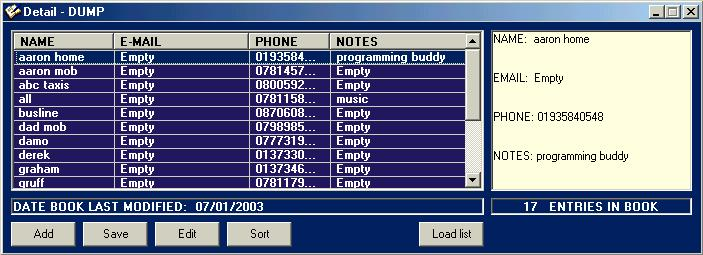



## Listview Address Book

### Description

reads a file line by line and parses data using a delimiter fron each line into relevent collums in a listview. oops sorry forgot a delete but you guys can do that as im doing something else at the moment.
 
### More Info
 

             |
---                |---
**Submitted On**   |2003-01-17 09:43:04
**By**             |[lee hayler](https://github.com/Planet-Source-Code/PSCIndex/blob/master/ByAuthor/lee-hayler.md)
**Level**          |Intermediate
**User Rating**    |5.0 (10 globes from 2 users)
**Compatibility**  |VB 5\.0, VB 6\.0
**Category**       |[Files/ File Controls/ Input/ Output](https://github.com/Planet-Source-Code/PSCIndex/blob/master/ByCategory/files-file-controls-input-output__1-3.md)
**World**          |[Visual Basic](https://github.com/Planet-Source-Code/PSCIndex/blob/master/ByWorld/visual-basic.md)
**Archive File**   |[Listview\_A1530461172003\.zip](https://github.com/Planet-Source-Code/lee-hayler-listview-address-book__1-42473/archive/master.zip)

